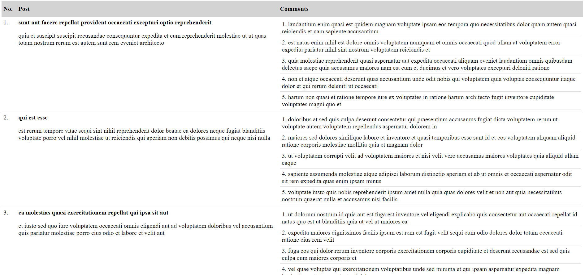

# Post REST API #

This is a project to demonstrate the workflow of REST services using Spring boot as a backend and AngularJS as a frontend. The sample endpoints interact with jsonplaceholder.typicode.com to exchange data.

### Pre-requisite ###
- Java-8
- maven
- git

### How to Run? ###
Please follow below mentioned steps:
#### Step 1 ####
Please run the below mentioned command, this command will generated required models in target folder, update the required dependencies and generate the runnable artifact in target folder

`mvn clean install`

#### Step 2 ####
Run **PostsApp.java** located in ./src/main/java/nz/co/posts in IDE or via commandline using below mentioned command by navigating to root folder *./target*:

`java -jar posts-rest-api-0.0.1-SNAPSHOT.jar`

#### Step 3 ####
Once server is up and running, we can use the **index.html** located in root directory to view the integration of rest endpoint with frontend written in AngularJS

for more details please contact *pramay.nz@gmail.com*
